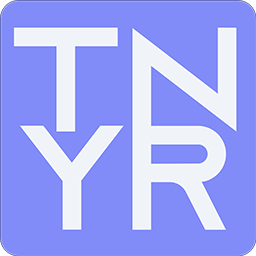
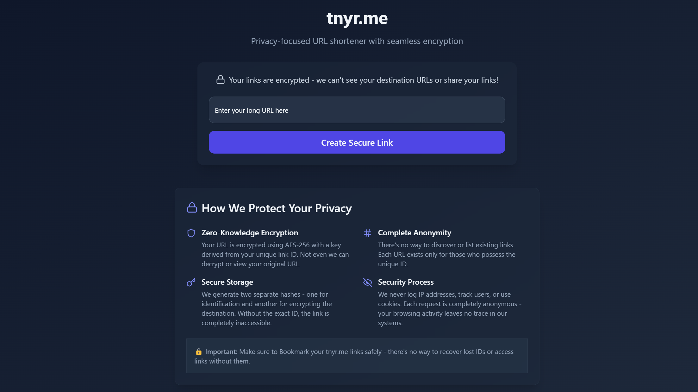

<div align="center">

<h1> https://tnyr.me - Privacy-First URL Shortener</h1>
</div>

[](https://opensource.org/licenses/MIT)

A secure, self-hosted URL shortener with custom paswordless encryption. Perfect for privacy-conscious users and organizations.



## Key Features

🔒 **Passwordless Encryption**  
📡 **No Tracking**   
🌐 **Modern Web Interface**  

## Encryption Process

1. **ID Generation**  
   - Unique random ID created for each link (e.g. `R53nSAg`)
   - Example: `google.com` → `tnyr.me/R53nSAg`

2. **Hashing**  
   - Two Argon2 hashes are calculated by using different salts

3. **Storage**  
   - Original URL encrypted with AES-256-GCM using Hash 2
   - Only Hash 1 (storage key) is saved in database

## Development Setup

### Prerequisites
- Python 3.9+
- Node.js 16+ (for frontend development)

### Quick Start
1. **Clone Repository**
   ```bash
   git clone https://github.com/sevi-py/tnyr.me.git
   cd tnyr/backend
   ```

2. **Install Dependencies**
   ```bash
   pip install -r requirements.txt
   ```

3. **Configuration**  
   Rename `config_template.json` to `config.json`  
   Generate salts using `python generate_salts.py`  
   Replace the placeholders with the salts you generated  

4. **Start Server**
   ```bash
   python main.py
   ```

5. Access at `http://localhost:5000`

## Frontend Development
The backend serves pre-built frontend files. To modify the frontend:

```bash
cd frontend
npm install
npm run build
```

## Why Choose [tnyr.me](https://tnyr.me)?

- **Privacy by Design**: We literally can't view your links
- **No Tracking**: Zero cookies, analytics, or fingerprinting
- **Self-Hostable**: Full control over your data
